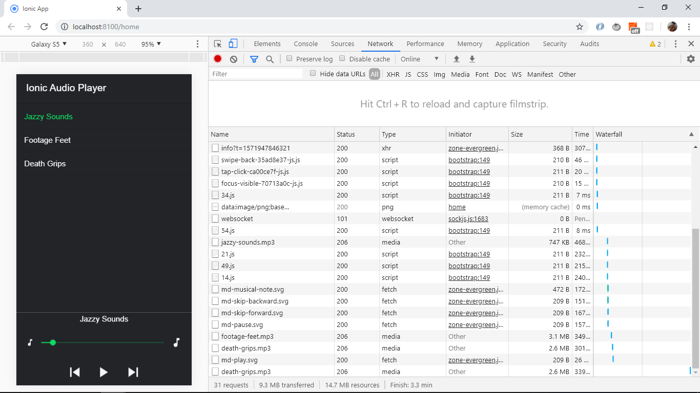

# :zap: Ionic Angular Audio Reproduction

* App to play mp3 audio files. This is another great tutorial from [Simon Grimm 'How to Build a Simple Ionic 4 Audio Player'](https://www.youtube.com/watch?v=d_rKawKDq58).

## :page_facing_up: Table of contents

* [:zap: Ionic Angular Audio Reproduction](#zap-ionic-angular-audio-reproduction)
  * [:page_facing_up: Table of contents](#page_facing_up-table-of-contents)
  * [:books: General info](#books-general-info)
  * [:camera: Screenshots](#camera-screenshots)
  * [:signal_strength: Technologies](#signal_strength-technologies)
  * [:floppy_disk: Setup](#floppy_disk-setup)
  * [:computer: Code Examples](#computer-code-examples)
  * [:cool: Features](#cool-features)
  * [:clipboard: Status & To-do list](#clipboard-status--to-do-list)
  * [:clap: Inspiration](#clap-inspiration)
  * [:envelope: Contact](#envelope-contact)

## :books: General info

* Uses the [Howler](https://www.npmjs.com/package/howler) audio library to play mp3 files.
* Updated to latest Ionic5 and Angular10 + dependencies

## :camera: Screenshots



## :signal_strength: Technologies

* [Ionic v5](https://ionicframework.com/)
* [Ionic/angular v5](https://ionicframework.com/)
* [Angular v10](https://angular.io/)
* [Howler v2](https://www.npmjs.com/package/howler)

## :floppy_disk: Setup

* To start the server on _localhost://8100_ type: 'ionic serve'
* To start the server on a mobile using Ionic devapp and connected via wifi, type: 'ionic serve --devapp'
* The Ionic DevApp was installed on an Android device from the Google Play app store.

## :computer: Code Examples

* function to start playing a track using the Howler audio library. Stops any previous track that was playing.

```typescript
  activeTrack: Track = null;
  player: Howl = null;
  isPlaying = false;

  start(track: Track) {
    if (this.player) {
      this.player.stop();
    }
    this.player = new Howl({
      src: [track.path],
      html5: true,
      onplay: () => {
        console.log('onplay');
        this.isPlaying = true;
        this.activeTrack = track;
        this.updateProgress();
      },
      onend: () => {
        console.log('End of track');
      }
    });
    this.player.play();
  }
```

## :cool: Features

* Howler audio library API defaults to the [W3C Web Audio API](https://webaudio.github.io/web-audio-api/) and falls back to [HTML5 Audio](https://html.spec.whatwg.org/multipage/media.html#the-audio-element).

## :clipboard: Status & To-do list

* Status: Working
* To-do: nothing

## :clap: Inspiration

* [Simon Grimm 'How to Build a Simple Ionic 4 Audio Player'](https://www.youtube.com/watch?v=d_rKawKDq58).

## :envelope: Contact

* Repo created by [ABateman](https://www.andrewbateman.org) - you are welcome to [send me a message](https://andrewbateman.org/contact)
